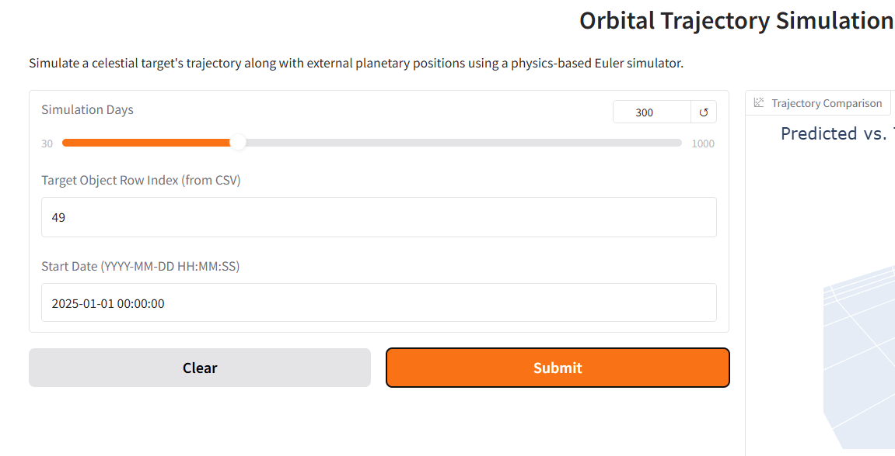
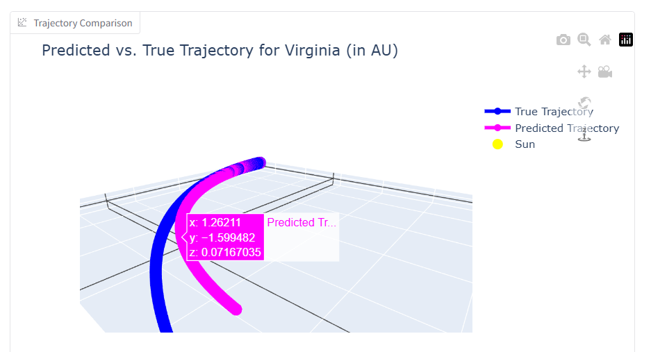
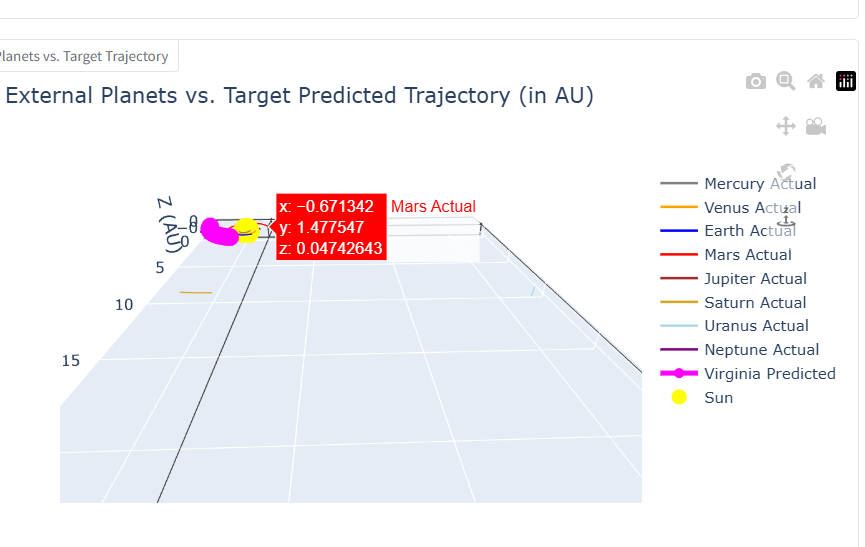

# Trajetory
🌌 Celestial Trajectory Prediction Using Deep Learning & AI
Using deep learning and machine learning with physics based models to predict trajectory of celestial bodies like asteroids , planets, moons

This project aims to predict the future trajectories of celestial bodies (e.g., asteroids, planets, satellites) using deep learning techniques, specifically Transformer-based and LSTM-based architectures. It leverages time-series data and AI to model and forecast motion in dynamic space environments with high accuracy.

🔭 Features
🚀 Predicts orbital paths based on historical spatial data

🧠 Uses Transformer and LSTM models for temporal sequence prediction

📈 Visualizes predicted vs. actual trajectories for evaluation

🎯 Focused on scientific accuracy and real-world relevance

💡 Designed for integration with larger simulation or satellite tracking systems

## 📷 Landing page

## 📷 For a particular Celsetial Body

## 📷 For all the PLanets and sun at centre

